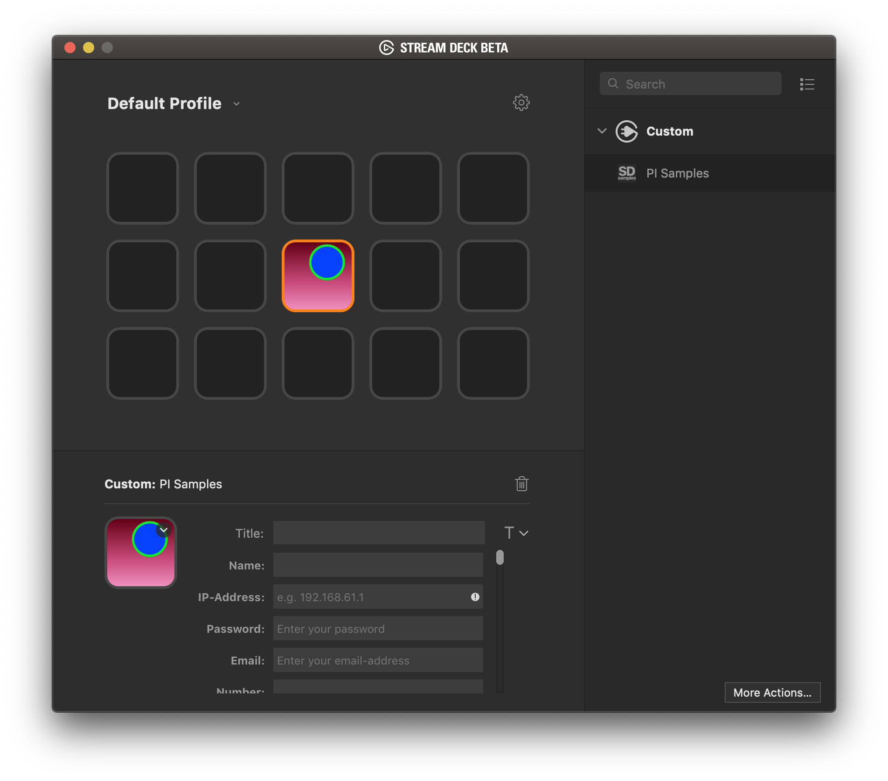

## Property Inspector

There are various types of fields that are supported in property inspector see [Elgato Github PiSamples](https://github.com/elgatosf/streamdeck-pisamples) and [Elgato SDK Documentation](https://developer.elgato.com/documentation/stream-deck/sdk/property-inspector/)

The above sample from GitHub allows you to drag and drop elements into your html for quick development.

Add it to the `property_inspector.html` file in the project.
